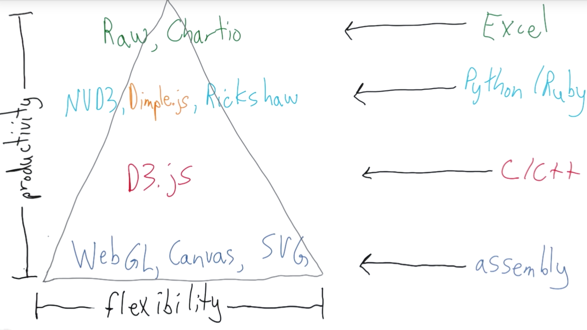

<!--
.. title: Visualization Fundamentals
.. slug: 01-visualization_fundamentals
.. date: 2017-04-21 15:05:27 UTC+08:00
.. tags:
.. category:
.. link:
.. description:
.. type: text
-->

**Data visualization** or **data visualisation** is viewed by many disciplines as a modern equivalent of [visual communication][d239a050]. It involves the creation and study of the visual representation of data, meaning "information that has been abstracted in some schematic form, including attributes or variables for the units of information".

  [d239a050]: https://en.wikipedia.org/wiki/Visual_communication "Visual Communication"

A primary goal of data visualization is to communicate information clearly and efficiently via [statistical graphics][55a6311d], [plots][675f42bb] and [information graphics][6b5d0226]. Numerical data may be encoded using dots, lines, or bars, to visually communicate a quantitative message. Effective visualization helps users analyze and reason about data and evidence. It makes complex data more accessible, understandable and usable. Users may have particular analytical tasks, such as making comparisons or understanding [causality][ffd934a5], and the design principle of the graphic (i.e., showing comparisons or showing causality) follows the task. Tables are generally used where users will look up a specific measurement, while charts of various types are used to show patterns or relationships in the data for one or more variables.

  [55a6311d]: https://en.wikipedia.org/wiki/Statistical_graphics "Statistical Graphics"
  [675f42bb]: https://en.wikipedia.org/wiki/Plot_(graphics) "Plots"
  [6b5d0226]: https://en.wikipedia.org/wiki/Infographic "Infographics"
  [ffd934a5]: https://en.wikipedia.org/wiki/Causality "Causality"

Data visualization is both an art and a science. It is viewed as a branch of [descriptive statistics][061af2dc] by some, but also as a [grounded theory][cceb4c49] development tool by others. Increased amounts of data created by Internet activity and an expanding number of sensors in the environment are referred to as "[big data][6c32b898]" or [Internet of things][50ba5873]. Processing, analyzing and communicating this data present ethical and analytical challenges for data visualization. The field of [data science][42074d51] and practitioners called [data scientists][ae0c95fb] help address this challenge.

  [061af2dc]: https://en.wikipedia.org/wiki/Descriptive_statistics "Descriptive Statistics"
  [cceb4c49]: https://en.wikipedia.org/wiki/Grounded_theory "Grounded Theory"
  [6c32b898]: https://en.wikipedia.org/wiki/Big_data "Big Data"
  [50ba5873]: https://en.wikipedia.org/wiki/Internet_of_things "Internet of Things"
  [42074d51]: https://en.wikipedia.org/wiki/Data_science "Data Science"
  [ae0c95fb]: https://en.wikipedia.org/wiki/Data_scientists "Data Scientists"

Contents  [hide]
1	Overview
2	Characteristics of effective graphical displays
3	Quantitative messages
4	Visual perception and data visualization
4.1	Human perception/cognition and data visualization
5	History of Data Visualization
6	Terminology
7	Examples of diagrams used for data visualization
8	Other perspectives
9	Data presentation architecture
9.1	Objectives
9.2	Scope
9.3	Related fields
10	See also
10.1	People (Historical)
10.1.1	People (active today)
11	References
12	Further reading
13	External links

## Overview     

Data visualization is one of the steps in analyzing data and presenting it to users.
Data visualization refers to the techniques used to communicate data or information by encoding it as visual objects (e.g., points, lines or bars) contained in graphics. The goal is to communicate information clearly and efficiently to users. It is one of the steps in [data analysis][863294eb] or [data science][42074d51]. According to Friedman (2008) the "main goal of data visualization is to communicate information clearly and effectively through graphical means. It doesn't mean that data visualization needs to look boring to be functional or extremely sophisticated to look beautiful. To convey ideas effectively, both aesthetic form and functionality need to go hand in hand, providing insights into a rather sparse and complex data set by communicating its key-aspects in a more intuitive way. Yet designers often fail to achieve a balance between form and function, creating gorgeous data visualizations which fail to serve their main purpose — to communicate information".

  [863294eb]: https://en.wikipedia.org/wiki/Data_analysis "Data Analysis"

Indeed, Fernanda Viegas and Martin M. Wattenberg have suggested that an ideal visualization should not only communicate clearly, but stimulate viewer engagement and attention.[6]

Data visualization is closely related to [information graphics][6b5d0226], [information visualization][6ede96f7], [scientific visualization][f4a281a3], [exploratory data analysis][24d39d1b] and [statistical graphics][55a6311d]. In the new millennium, data visualization has become an active area of research, teaching and development. According to Post et al. (2002), it has united scientific and information visualization.

  [6ede96f7]: https://en.wikipedia.org/wiki/Information_visualization "Information Visualization"
  [f4a281a3]: https://en.wikipedia.org/wiki/Scientific_visualization "Scientific Visualization"
  [24d39d1b]: https://en.wikipedia.org/wiki/Exploratory_data_analysis "Exploratory Data Analysis"

## Characteristics of effective graphical displays      

.svg#/media/File:Minard%27s_Map_(vectorized).svg)
"Charles Joseph Minard's 1869 diagram of Napoleon's March - an early example of an information graphic."    

"The greatest value of a picture is when it forces us to notice what we never expected to see."  by John Tukey

Professor Edward Tufte explained that users of information displays are executing particular analytical tasks such as making comparisons or determining causality. The design principle of the information graphic should support the analytical task, showing the comparison or causality.[9]

In his 1983 book _The Visual Display of Quantitative Information_, Edward Tufte defines 'graphical displays' and principles for effective graphical display in the following passage: "Excellence in statistical graphics consists of complex ideas communicated with clarity, precision and efficiency. Graphical displays should:      

- show the data    
- induce the viewer to think about the substance rather than about methodology, graphic design, the technology of graphic production or something else    
- avoid distorting what the data has to say     
- present many numbers in a small space     
- make large data sets coherent    
- encourage the eye to compare different pieces of data    
- reveal the data at several levels of detail, from a broad overview to the fine structure     
- serve a reasonably clear purpose: description, exploration, tabulation or decoration    
- be closely integrated with the statistical and verbal descriptions of a data set.    

Graphics reveal data. Indeed graphics can be more precise and revealing than conventional statistical computations."

For example, the Minard diagram shows the losses suffered by Napoleon's army in the 1812–1813 period. Six variables are plotted: the size of the army, its location on a two-dimensional surface (x and y), time, direction of movement, and temperature. The line width illustrates a comparison (size of the army at points in time) while the temperature axis suggests a cause of the change in army size. This multivariate display on a two dimensional surface tells a story that can be grasped immediately while identifying the source data to build credibility. Tufte wrote in 1983 that: "It may well be the best statistical graphic ever drawn."[10]

Not applying these principles may result in [misleading graphs][18edab12], which distort the message or support an erroneous conclusion. According to Tufte, [chartjunk][19629d71]to extraneous interior decoration of the graphic that does not enhance the message, or gratuitous three dimensional or perspective effects. Needlessly separating the explanatory key from the image itself, requiring the eye to travel back and forth from the image to the key, is a form of "administrative debris." The ratio of "data to ink" should be maximized, erasing non-data ink where feasible.[10]

  [18edab12]: https://en.wikipedia.org/wiki/Misleading_graphs "Misleading Graphs"
  [19629d71]: https://en.wikipedia.org/wiki/Chartjunk "Chart Junk"

The Congressional Budget Office summarized several best practices for graphical displays in a June 2014 presentation. These included:
a) Knowing your audience;     
b) Designing graphics that can stand alone outside the context of the report; and     
c) Designing graphics that communicate the key messages in the report.

## Quantitative messages       

A time series illustrated with a line chart demonstrating trends in U.S. federal spending and revenue over time.

A scatterplot illustrating negative correlation between two variables (inflation and unemployment) measured at points in time.

Author Stephen Few described eight types of quantitative messages that users may attempt to understand or communicate from a set of data and the associated graphs used to help communicate the message:      

1. Time-series: A single variable is captured over a period of time, such as the unemployment rate over a 10-year period. A [line chart][3bf3c620] may be used to demonstrate the trend.     
2. Ranking: Categorical subdivisions are ranked in ascending or descending order, such as a ranking of sales performance (the _measure_) by sales persons (the _category_, with each sales person a _categorical subdivision_) during a single period. A [bar chart][b2b2191d] may be used to show the comparison across the sales persons.     
3. Part-to-whole: Categorical subdivisions are measured as a ratio to the whole (i.e., a percentage out of 100%). A [pie chart][e282da97] or bar chart can show the comparison of ratios, such as the market share represented by competitors in a market.      
4. Deviation: Categorical subdivisions are compared against a reference, such as a comparison of actual vs. budget expenses for several departments of a business for a given time period. A bar chart can show comparison of the actual versus the reference amount.       
5. Frequency distribution: Shows the number of observations of a particular variable for given interval, such as the number of years in which the stock market return is between intervals such as 0-10%, 11-20%, etc. A [histogram][50117dc6], a type of bar chart, may be used for this analysis. A [boxplot][de34d4e8] helps visualize key statistics about the distribution, such as median, quartiles, outliers, etc.      
6. Correlation: Comparison between observations represented by two variables (X,Y) to determine if they tend to move in the same or opposite directions. For example, plotting unemployment (X) and inflation (Y) for a sample of months. A [scatter plot][22fd5ce9] is typically used for this message.     
7. Nominal comparison: Comparing categorical subdivisions in no particular order, such as the sales volume by product code. A bar chart may be used for this comparison.       
8. Geographic or geospatial: Comparison of a variable across a map or layout, such as the unemployment rate by state or the number of persons on the various floors of a building. A [cartogram][aa4f5a8c] is a typical graphic used.     

  [3bf3c620]: https://en.wikipedia.org/wiki/Line_chart "Line Chart"
  [b2b2191d]: https://en.wikipedia.org/wiki/Bar_chart "Bar Chart"
  [e282da97]: https://en.wikipedia.org/wiki/Pie_chart "Pie Chart"
  [50117dc6]: https://en.wikipedia.org/wiki/Histogram "Histogram"
  [de34d4e8]: https://en.wikipedia.org/wiki/Boxplot "Boxplot"
  [22fd5ce9]: https://en.wikipedia.org/wiki/Scatter_plot "Scatter Plot"
  [aa4f5a8c]: https://en.wikipedia.org/wiki/Cartogram "Cartogram"

Analysts reviewing a set of data may consider whether some or all of the messages and graphic types above are applicable to their task and audience. The process of trial and error to identify meaningful relationships and messages in the data is part of [exploratory data analysis][24d39d1b].

## Visual perception and data visualization        
A human can distinguish differences in line length, shape, orientation, and color (hue) readily without significant processing effort; these are referred to as "[pre-attentive attributes][dba7fce6]". For example, it may require significant time and effort ("attentive processing") to identify the number of times the digit "5" appears in a series of numbers; but if that digit is different in size, orientation, or color, instances of the digit can be noted quickly through pre-attentive processing.

  [dba7fce6]: https://en.wikipedia.org/wiki/Pre-attentive_processing "Pre-attentive Processing"

Effective graphics take advantage of pre-attentive processing and attributes and the relative strength of these attributes. For example, since humans can more easily process differences in line length than surface area, it may be more effective to use a bar chart (which takes advantage of line length to show comparison) rather than pie charts (which use surface area to show comparison).

### Human perception/cognition and data visualization     
Almost all data visualizations are created for human consumption. Knowledge of human perception and cognition is necessary when designing intuitive visualizations.  Cognition refers to processes in human beings like perception, attention, learning, memory, thought, concept formation, reading, and problem solving. Human visual processing is efficient in detecting changes and making comparisons between quantities, sizes, shapes and variations in lightness. When properties of symbolic data are mapped to visual few properties, humans can browse through large amounts of data efficiently.  [It][70926771] is estimated that 2/3 of the brain's neurons can be involved in visual processing.  Proper visualization provides a different approach to show potential connections, relationships, etc. which are not as obvious in non-visualized quantitative data. Visualization can become a means of data exploration.

  [70926771]: https://en.wikipedia.org/wiki/Data_exploration "Data Exploration"

## History of Data Visualization    
There is a history of data visualization: beginning in the 2nd century C.E. with data arrangement into columns and rows and evolving to the initial quantitative representations in the 17th century.[14] According to the Interaction Design Foundation, French philosopher and mathematician René Descartes laid the ground work for Scotsman William Playfair. Descartes developed a two-dimensional coordinate system for displaying values, which in the late 18th century Playfair saw potential for graphical communication of quantitative data.[14] In the second half of the 20th century, Jacques Bertin used quantitative graphs to represent information "intuitively, clearly, accurately, and efficiently".[14]

John Tukey and Edward Tufte pushed the bounds of data visualization; Tukey with his new statistical approach of exploratory data analysis and Tufte with his book "The Visual Display of Quantitative Information" paved the way for refining data visualization techniques for more than statisticians. With the progression of technology came the progression of data visualization; starting with hand drawn visualizations and evolving into more technical applications – including interactive designs leading to software visualization.[17] Programs like [SAS][e3d17bc0], [SOFA][c1a5f06a], [R][075770f9], [Minitab][d7e7ad3f], and more allow for data visualization in the field of statistics. Other data visualization applications, more focused and unique to individuals, programming languages such as D3, Python and JavaScript help to make the visualization of quantitative data a possibility.

  [e3d17bc0]: https://en.wikipedia.org/wiki/SAS_(software) "SAS"
  [c1a5f06a]: https://en.wikipedia.org/wiki/SOFA_Statistics "SOFA Statistics"
  [075770f9]: https://en.wikipedia.org/wiki/R_(programming_language) "R"
  [d7e7ad3f]: https://en.wikipedia.org/wiki/Minitab "Minitab"

## Terminology       
Data visualization involves specific terminology, some of which is derived from statistics. For example, author Stephen Few defines two types of data, which are used in combination to support a meaningful analysis or visualization:

- Categorical: Text labels describing the nature of the data, such as "Name" or "Age". This term also covers qualitative (non-numerical) data.    
- Quantitative: Numerical measures, such as "25" to represent the age in years.

Two primary types of information displays are tables and graphs.     

- A table contains quantitative data organized into rows and columns with categorical labels. It is primarily used to look up specific values. In the example above, the table might have categorical column labels representing the name (a qualitative variable) and age (a quantitative variable), with each row of data representing one person (the sampled experimental unit or category subdivision).      
- A graph is primarily used to show relationships among data and portrays values encoded as visual objects (e.g., lines, bars, or points). Numerical values are displayed within an area delineated by one or more axes. These axes provide scales (quantitative and categorical) used to label and assign values to the visual objects. Many graphs are also referred to as charts.      

KPI Library has developed the "[Periodic Table of Visualization Methods][c86d9fe2]", an interactive chart displaying various data visualization methods. It includes six types of data visualization methods: data, information, concept, strategy, metaphor and compound.

  [c86d9fe2]: http://www.visual-literacy.org/periodic_table/periodic_table.html "Periodic Table of Visualization Methods"

## Other perspectives
There are different approaches on the scope of data visualization. One common focus is on information presentation, such as Friedman (2008) presented it. In this way Friendly (2008) presumes two main parts of data visualization: [statistical graphics][55a6311d], and [thematic cartography][8ed66128]. In this line the "Data Visualization: Modern Approaches" (2007) article gives an overview of seven subjects of data visualization:         

  [8ed66128]: https://en.wikipedia.org/wiki/Thematic_map "Thematic Cartography"

- Articles & resources     
- Displaying connections    
- Displaying data    
- Displaying news   
- Displaying websites     
- Mind maps    
- Tools and services     

All these subjects are closely related to [graphic design][04ac3d60] and information representation.

  [04ac3d60]: https://en.wikipedia.org/wiki/Graphic_design "Graphic Design"

On the other hand, from a computer science perspective, Frits H. Post (2002) categorized the field into a number of sub-fields:      

- [Information visualization][95345390]    
- [Interaction techniques][86910fd9] and architectures      
- Modelling techniques    
- Multiresolution methods      
- Visualization algorithms and techniques      
- [Volume visualization][6dcc62b0]     

  [95345390]: https://en.wikipedia.org/wiki/Information_visualization "Information Visualization"
  [86910fd9]: https://en.wikipedia.org/wiki/Interaction_techniques "Interaction Techniques"
  [6dcc62b0]: https://en.wikipedia.org/wiki/Volume_visualization "Volume Visualization"

## Data presentation architecture      

A data visualization from social media

**Data presentation architecture (DPA)** is a skill-set that seeks to identify, locate, manipulate, format and present data in such a way as to optimally communicate meaning and proper knowledge.

Historically, the term data presentation architecture is attributed to Kelly Lautt:[22] "Data Presentation Architecture (DPA) is a rarely applied skill set critical for the success and value of [Business Intelligence][7e6ed68e]. Data presentation architecture weds the science of numbers, data and statistics in [discovering valuable information][0492bf5d] from data and making it usable, relevant and actionable with the arts of data visualization, communications, [organizational psychology][2849aefd] and [change management][4e84b51f] in order to provide business intelligence solutions with the data scope, delivery timing, format and visualizations that will most effectively support and drive operational, tactical and strategic behaviour toward understood business (or organizational) goals. DPA is neither an IT nor a business skill set but exists as a separate field of expertise. Often confused with data visualization, data presentation architecture is a much broader skill set that includes determining what data on what schedule and in what exact format is to be presented, not just the best way to present data that has already been chosen. Data visualization skills are one element of DPA."

  [7e6ed68e]: https://en.wikipedia.org/wiki/Business_Intelligence "Business Intelligence"
  [0492bf5d]: https://en.wikipedia.org/wiki/Information_discovery "Information Discovery"
  [2849aefd]: https://en.wikipedia.org/wiki/Organizational_psychology "Organization Psychology"
  [4e84b51f]: https://en.wikipedia.org/wiki/Change_management "Change Management"

### Objectives       

DPA has two main objectives:     

- To use data to provide knowledge in the most efficient manner possible (minimize noise, complexity, and unnecessary data or detail given each audience's needs and roles)       
- To use data to provide knowledge in the most effective manner possible (provide relevant, timely and complete data to each audience member in a clear and understandable manner that conveys important meaning, is actionable and can affect understanding, behavior and decisions)     

### Scope     

With the above objectives in mind, the actual work of data presentation architecture consists of:       

- Creating effective delivery mechanisms for each audience member depending on their role, tasks, locations and access to technology     
- Defining important meaning (relevant knowledge) that is needed by each audience member in each context     
- Determining the required periodicity of data updates (the currency of the data)     
- Determining the right timing for data presentation (when and how often the user needs to see the data)     
- Finding the right data (subject area, historical reach, breadth, level of detail, etc.)       
- Utilizing appropriate analysis, grouping, visualization, and other presentation formats     

### Related fields     

DPA work shares commonalities with several other fields, including:      

- Business analysis in determining business goals, collecting requirements, mapping processes.     
- Business process improvement in that its goal is to improve and streamline actions and decisions in furtherance of business goals      
- Data visualization in that it uses well-established theories of visualization to add or highlight meaning or importance in data presentation.      
- Graphic or user design: As the term DPA is used, it falls just short of design in that it does not consider such detail as colour palates, styling, branding and other aesthetic concerns, unless these design elements are specifically required or beneficial for communication of meaning, impact, severity or other information of business value. For example:      
    - choosing locations for various data presentation elements on a presentation page (such as in a company portal, in a report or on a web page) in order to convey hierarchy, priority, importance or a rational progression for the user is part of the DPA skill-set.      
    - choosing to provide a specific colour in graphical elements that represent data of specific meaning or concern is part of the DPA skill-set       
- Information architecture, but information architecture's focus is on unstructured data and therefore excludes both analysis (in the statistical/data sense) and direct transformation of the actual content (data, for DPA) into new entities and combinations.        
- Solution architecture in determining the optimal detailed solution, including the scope of data to include, given the business goals        
- Statistical analysis or data analysis in that it creates information and knowledge out of data       

See also[edit]
Analytics
Balanced scorecard
Business analysis
Business intelligence
Data analysis
Data profiling
Data warehouse
Exploratory data analysis
Infographic
Information architecture
Information design
Information visualization
Interaction design
Interaction techniques
Scientific visualization
Software visualization
Statistical analysis
Statistical graphics
Visual analytics
People (Historical)[edit]
Charles Joseph Minard
John Tukey
John Snow
Otto Neurath
Florence Nightingale
William Playfair
People (active today)[edit]
Alberto Cairo
Edward Tufte
Ola Rosling - Rosling developed the scatter-plot graphing tool used on Gapminder.org.
Hans Rosling
Aaron Koblin
Manuel Lima
Max Roser - Roser is an economist at the University of Oxford and author of the online data visualisation publication Our World In Data.
Moritz Stefaner
Ben Shneiderman
Fernanda Viégas
Martin M. Wattenberg
Mona Chalabi - Data journalist at FiveThirtyEight. Previously at the Guardian, the Bank of England, and the Economist Intelligence Unit.
George Furnas
Branko Milanovic
Mike Bostock - Bostock is one of the key developers of the Javascript library d3.js.
Adrien Segal - Oakland, CA based artist known for her sculptures based on tidal and snow data.
Jeffrey Heer
Leland Wilkinson
Hadley Wickham

## Video Lesson Notes:
### 1. What is Data Visualization     
### 2. Defining Data Visualization     

You can find Scott Murray's book, [Interactive Data Visualization for the Web: An Introduction to Designing with D3][b071ecdc], here.      

  [b071ecdc]: http://chimera.labs.oreilly.com/books/1230000000345/ "Scott Murray's Interactive Data Visualization for the Web"

Cole Nussbaumer published an excellent book, [Storytelling with Data: a Data Visualization Guide for Business Professionals][8d65e38d].

  [8d65e38d]: http://www.amazon.com/gp/product/1119002257?ie=UTF8&creativeASIN=1119002257&linkCode=xm2&tag=storytellingwithdata-20 "Cole Nussbaumer's Storytelling with Data"

Storytelling with Data teaches you the fundamentals of data visualization and how to communicate effectively with data. You'll discover the power of storytelling and the way to make data a pivotal point in your story. The lessons in this illuminative text are grounded in theory, but made accessible through numerous real-world examples—ready for immediate application to your next graph or presentation.

### 3. Good Data Visualization      

Cole Nussbaumer published an excellent book, Storytelling with Data: a Data Visualization Guide for Business Professionals.     

Storytelling with Data teaches you the fundamentals of data visualization and how to communicate effectively with data. You'll discover the power of storytelling and the way to make data a pivotal point in your story. The lessons in this illuminative text are grounded in theory, but made accessible through numerous real-world examples—ready for immediate application to your next graph or presentation.

You can also learn more about data visualization by reading Cole's blog, [storytellingwithdata.com][9c79e415].

  [9c79e415]: http://www.storytellingwithdata.com/ "Storytelling with Data"

If you aren't sure where to start looking, try the following links.    

- https://twitter.com/nytgraphics    
 http://www.smallmeans.com/new-york-times-infographics/    
- http://flowingdata.com/    
- http://infosthetics.com/    

You can find the [Good Data Visualizations][c038d9cf] discussion topic here.

  [c038d9cf]: https://discussions.udacity.com/t/lesson-1a-good-data-visualizations-dand/25155/30 "Good Data Visualization Discussion"

### 4. The Functional Art: Obesity And Education
Blog Post
Alberto Cairo's Three Steps to Become a Visualization Designer by Andy Kriebel

### 5. Slope Graphs
@0:42 Cole misspeaks by saying "and a positive relationship here in the red states". She meant to say "and an inverse relationship in the red states". @2:00 it is stated that the slope of the lines can show the percent difference between two groups, which is not precisely true. The slope graph does indicate direction and magnitude of change.

Click the following link to view an image of the [slope graph][fdac5c30]. You can learn more about data visualization from Cole's blog, Storytelling with Data.

  [fdac5c30]: http://www.storytellingwithdata.com/2014/03/more-on-slopegraphs.html "Slope Graph"

### 6. Words of Wisdom from Zipfian Academy

### 7. Design Code Tell

### 8. Data Visualization and You  

### 9. The Data Science Process

Computer Science  | Statistics and Data Mining |   Graphic Design   |  InfoVis and HCI  |
------------------|----------------------------|--------------------|-------------------|
acquire     parse | filter                mine | represent   refine |       interact    |

### 10. Details of the Data Science Process   

[Data Munging or Data Wrangling][a944be0c]

  [a944be0c]: http://en.wikipedia.org/wiki/Data_wrangling "Data Wrangling"

InfoVis stands for [Information Visualization][9df1ca2e]

  [9df1ca2e]: http://en.wikipedia.org/wiki/Information_visualization "Information Visualization"

HCI stands for [Human-Computer Interaction][d42017f1]

  [d42017f1]: http://en.wikipedia.org/wiki/Human%E2%80%93computer_interaction "Human Computer Interaction"

### 11. DataViz in Data Science    

### 12. Iterating through Visualization    

### 13. Exploratory vs Explainatory

### 14. Anscombe’s Quartet    

[Anscombe’s Quartet ][4c41c986]
The plots were constructed in 1973 by the statistician Francis Anscombe to demonstrate both the importance of graphing data before analyzing it and the effect of outliers on statistical properties.

  [4c41c986]: http://en.wikipedia.org/wiki/Anscombe's_quartet "Anscombe’s Quartet"

### 15. Why Even Create Graphics?
@0:44 Chris discusses the percentage 0.7%. He means to say that our awareness is only 0.7% of our total "bandwidth."

[Edward Tufte elaborates on the speed of visual perception on his website][e178449c].

  [e178449c]: http://www.edwardtufte.com/bboard/q-and-a-fetch-msg?msg_id=0002NC "Edward Tufte on Visual Perceptions"

Penn researchers calculate how much the eye tells the brain in [this paper][5f6b6c20].

  [5f6b6c20]: http://www.eurekalert.org/pub_releases/2006-07/uops-prc072606.php "Penn State Paper on Visual Perceptions"

### 16. Data Types    

Hans Rosling’s 200 Countries, 200 Years, 4 Minutes https://www.youtube.com/watch?v=jbkSRLYSojo

Different Data Types 1 - Numerical Data https://classroom.udacity.com/courses/ud359/lessons/692548568/concepts/6785689350923

Different Data Types 2 - Categorical Data https://www.udacity.com/course/viewer#!/c-ud359/l-692548568/m-678568936

Different Data Types 3 - Time Series Data https://classroom.udacity.com/courses/ud359/lessons/692548568/concepts/6785689370923

### 17. Identifying Data Types    

[Healthcare spending and life expectancy from OECD Health Data 2009][a2f197c1]

  [a2f197c1]: http://charliepark.org/images/slopegraphs/natgeo_scatter.jpg "OECD Health Data 2009 Plot"

@0:46 Chris says "health insurance" instead of "universal health coverage".

### 18. Visual Encodings    

@0:34 spending per person should be income per person

[Gapminder World Visualization][099ba7b0]

  [099ba7b0]: http://www.gapminder.org/world/ "Gapminder"

Stephen Few's article on [Rules for Using Encodings in Graphs][752f0f2e]

  [752f0f2e]: http://www.perceptualedge.com/articles/b-eye/encoding_values_in_graph.pdf "Stephen Few's Rules for Visual Encodings"

### 19.  World Cup Top Scores    

### 20.  Win/Lose/Draw     

### 21. Rankings Of Visual Encodings   

[Graphical Perception Paper by Cleveland and McGill][ac478221]

  [ac478221]: https://web.cs.dal.ca/~sbrooks/csci4166-6406/seminars/readings/Cleveland_GraphicalPerception_Science85.pdf "Graphical Perception Paper by Cleveland and McGill"

[Nathan's Yau summarizes the findings of the paper and provides sound advice][5887a0ef] for putting it into practice on his blog, Flowing Data.

  [5887a0ef]: http://flowingdata.com/2010/03/20/graphical-perception-learn-the-fundamentals-first/ "Summary of the Paper"

tl;dr
Keep in mind this list isn’t meant to be a definitive answer on what to use and what not to in your data graphics.

Cleveland and McGill note, “The ordering does not result in a precise prescription for displaying data but rather is a framework within which to work.” -Nathan Yau

### 22.  Decomposing Visualizations    

This is a chance for you to find more visualizations in the wild!

[Decomposing Visualizations Examples][a29ee349]

  [a29ee349]: http://www.targetprocess.com/articles/visual-encoding.html "Decomposing Visualization"

### 23. The Facebook Offering     

### 24. The Facebook Offering Animation

The [UK Temperature History][3e816a49] is an interesting data visualization that uses the z-axis to animate and encode changes over time. Can you spot other interesting parts of the design? Post your thoughts in the discussions!

  [3e816a49]: http://charts.animateddata.co.uk/uktemperaturelines/ "UK Temperature History"

### 25. Transition to the Tech Portion    

### 26. Ups and Downs of the Visualization Spectrum

Some of the Visualization Technologies   

- [HTML5 Canvas][50c0bf10]
- [WebGL][0f280ed2]
- [SVG (Scalable Vector Graphics)][5d22bab6]
- [D3.js][cdc9ddd1]
- [NVD3][c79bc5e1]
- [Dimple.js][305f364c]
- [Rickshaw][9089bac4]
- [Chartio][319c5a0b]
- [RAW][6b61702a]

  [50c0bf10]: https://developer.mozilla.org/en-US/docs/Web/API/Canvas_API "HTML5 Canvas"
  [0f280ed2]: http://en.wikipedia.org/wiki/WebGL "WebGL"
  [5d22bab6]: https://developer.mozilla.org/en-US/docs/Web/SVG "SVG"
  [cdc9ddd1]: http://d3js.org/ "D3"
  [c79bc5e1]: http://nvd3.org/ "NVD3"
  [305f364c]: http://dimplejs.org/ "Dimple JS"
  [9089bac4]: http://code.shutterstock.com/rickshaw/ "Rickshaw"
  [319c5a0b]: https://chartio.com/ "Chart IO"
  [6b61702a]: http://raw.densitydesign.org/ "Raw JS"

### 27. D3 Web Technologies
Based on HTML, Javascript, CSS and SVG.  

### 28. D3: Unpacking The Name    

@1:12 Jonathan mentions the DOM.

For more context and information about the DOM, please watch [Converting HTML to the DOM][528f33fc]. (from [Website Performance Optimization][9b88963c])

  [528f33fc]: https://classroom.udacity.com/courses/ud884/lessons/1464158642/concepts/15290985490923 "Converting HTML to the DOM"
  [9b88963c]: https://www.udacity.com/course/ud884 "Website Performance Optimization"

For more information about CSV and JSON files, please watch CSV Format and Intro to JSON. (from [Data Wrangling with Mongo DB][32128a3d])

  [32128a3d]: https://www.udacity.com/course/ud032 "Data Wrangling with Mongo DB"

### 29. Why D3?

[Web Scripting: Client-Side and Server-Side][25409a72]

  [25409a72]: http://education-portal.com/academy/lesson/web-scripting-client-side-and-server-side.html#lesson "Web Scripting: Client Side and Server-Side"

@0:23 seperation should be separation

@0:48 To clarify, Jonathan could also have said "and D3 code can actually manipulate existing pages and html documents".
